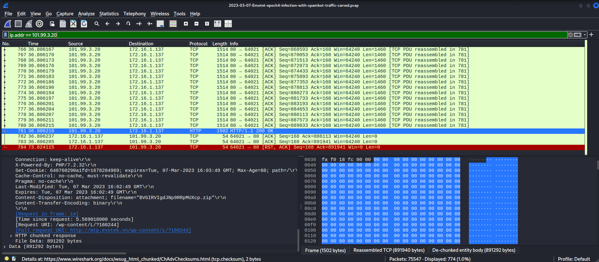
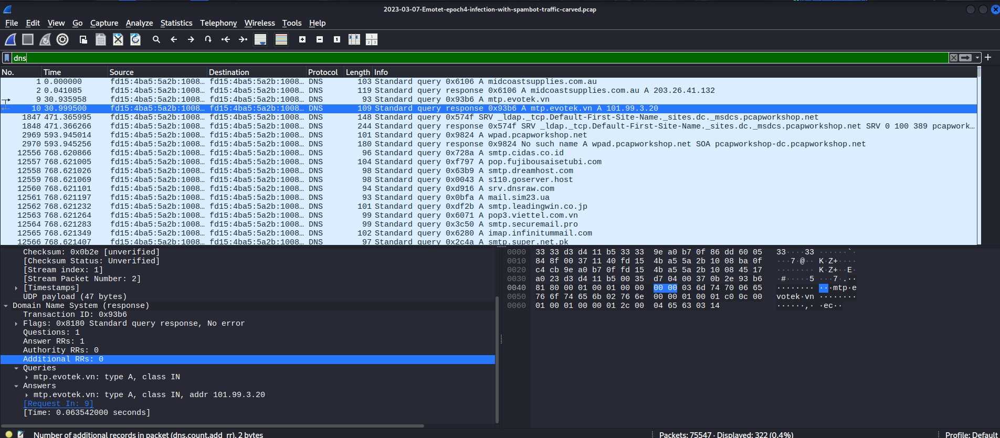
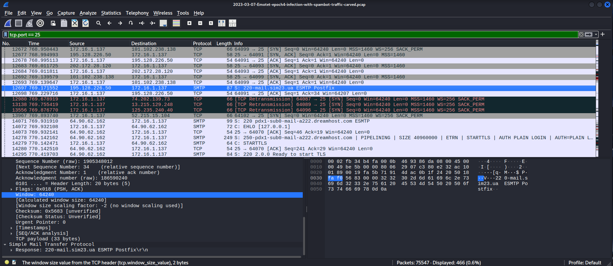
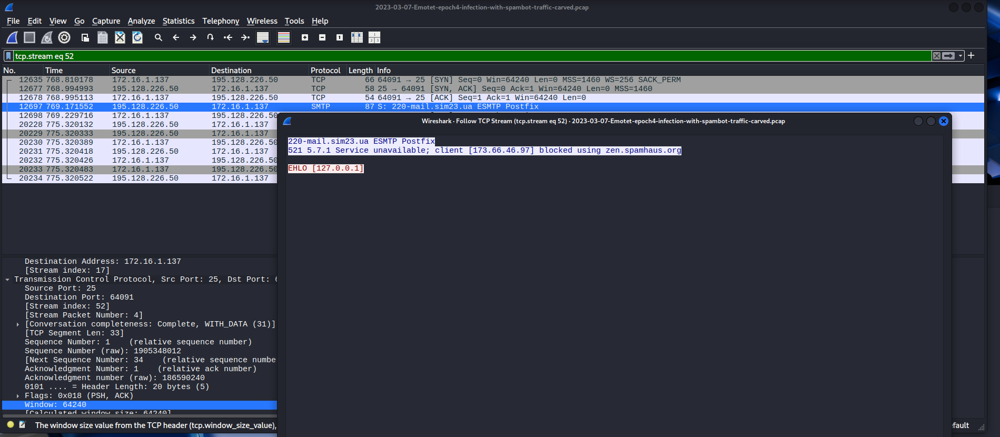
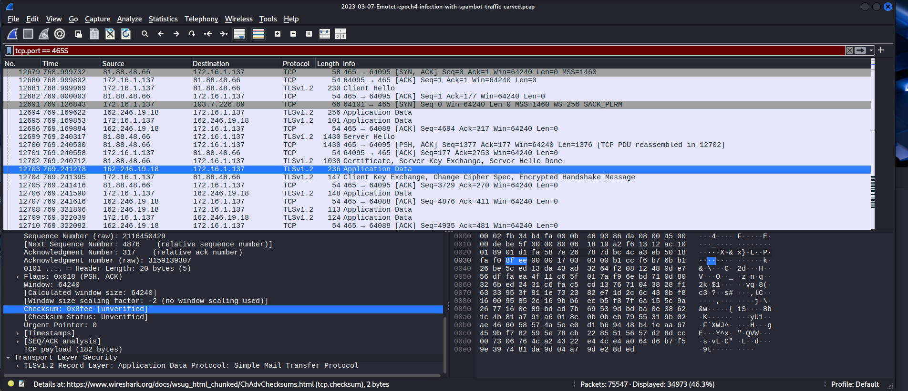
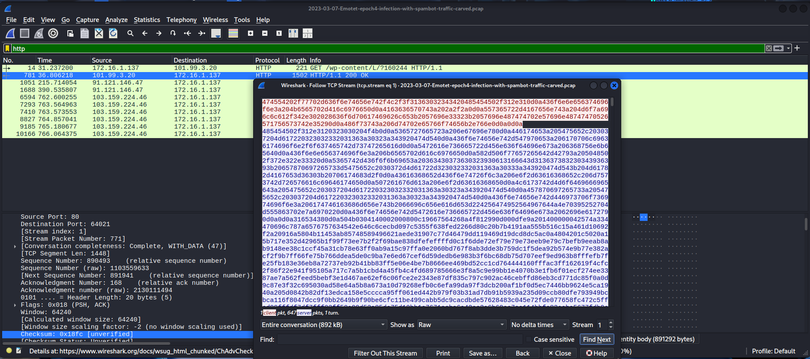
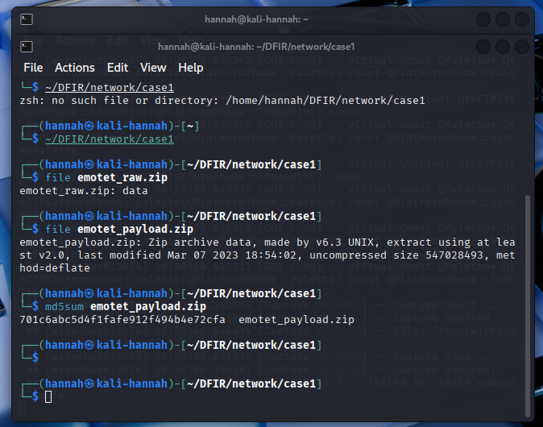
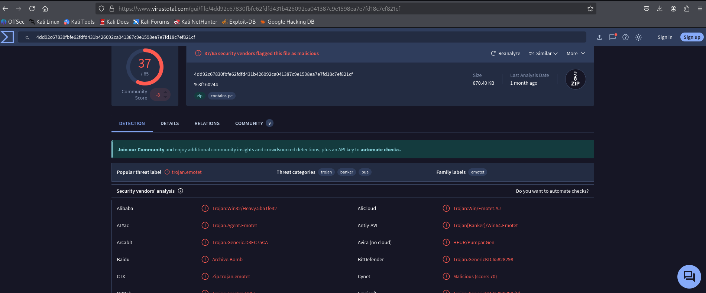

# Emotet Epoch4 Spambot Infection – March 2023 PCAP Analysis

**Tools Used:** Wireshark, VirusTotal, Linux CLI  
**File Hash:** 701c6abc5d4f1fafe912f494b4e72cfa

## Objective

The objective of this case study was to analyze real-world Emotet spambot traffic captured in a PCAP file, identify key indicators of compromise, and extract the payload for verification. The analysis covers DNS resolution, payload delivery over HTTP, spam module behavior via SMTP, and encrypted command-and-control communications using STARTTLS.

## Case Timeline and Observations

### 1. Payload Download via HTTP  
 
- A suspicious `.zip` file was downloaded from `/wp-content/L/?160244` using HTTP.  
- The hosting IP address was `101.99.3.20`.

### 2. Domain Resolution  

- A DNS query was issued for `mtp.evotek.vn` (frame 10).  
- The resolved IP matched the one serving the malicious payload.

### 3. SMTP Spambot Initialization  
 
- The infected host attempted to initiate an SMTP session with `mail.sim23.ua` on port 25.  
- The response included a `220 ESMTP` banner, indicating the beginning of a spam-sending attempt.

### 4. SMTP Blacklisting  
  
- An additional SMTP connection to `173.66.46.97` failed due to Spamhaus blocking (`521 5.7.1`).  
- This confirmed evasion attempts and blacklisting behavior.

### 5. STARTTLS Encryption  

- The SMTP session upgraded to a secure channel using STARTTLS.  
- TLS handshake (Client Hello, Certificate, Server Key Exchange) was visible, but the actual email content remained encrypted.

### 6. TCP Stream Extraction  
 
- The ZIP payload was extracted using Wireshark’s Follow TCP Stream feature.  
- The file was saved locally for verification.

### 7. Payload Hash and Verification  
 
- The SHA256 hash of the payload (`701c6abc5d4f1fafe912f494b4e72cfa`) was computed and submitted to VirusTotal.

### 8. VirusTotal Results  

- VirusTotal flagged the file with 50+ detections including aliases like Emotet, Trojan.Win32, and Injector.

## MITRE ATT&CK Summary

| What Was Observed                             | Tactic                | Technique                                  | ID         |
|-----------------------------------------------|------------------------|---------------------------------------------|------------|
| Downloaded .zip via HTTP                      | Ingress Tool Transfer  | Transfer of tools or malware               | T1105      |
| File delivered via phishing link              | Initial Access         | Spearphishing Link                         | T1566.001  |
| Victim executed ZIP or EXE file               | Execution              | User Execution                             | T1204.002  |
| SMTP used to send encrypted spam              | Command and Control    | Application Layer Protocol: Mail (SMTP)    | T1071.003  |
| TLS used to hide email contents (STARTTLS)    | Defense Evasion        | Obfuscated Files or Information            | T1140      |

*Full ATT&CK mappings available in* [`MITRE_ATT&CK_Mapping.md`](MITRE_ATT&CK_Mapping.md)

## Indicators of Compromise (IOCs)

See [`ioc_table.md`](ioc_table.md) for a full list of extracted indicators including domains, IPs, ports, JA3 hashes, and protocol data.

## Limitations

- **Encrypted C2 content could not be analyzed** due to STARTTLS obfuscation. While TLS handshake was observed, the actual spam messages and C2 commands remain hidden.
- **JA3 fingerprinting was conducted post-extraction**, but correlation with known threat actor infrastructure requires further enrichment.
- **Only network-layer evidence was reviewed**. No host-based forensics (registry, memory, persistence) were performed in this case.
- **Payload was not detonated** in a sandbox, so execution behavior was inferred based on VirusTotal and known Emotet indicators.
- 
## Author: 
**Hannah Susan Cherian**
CyberSecurity Student | DFIR Enthusiast

